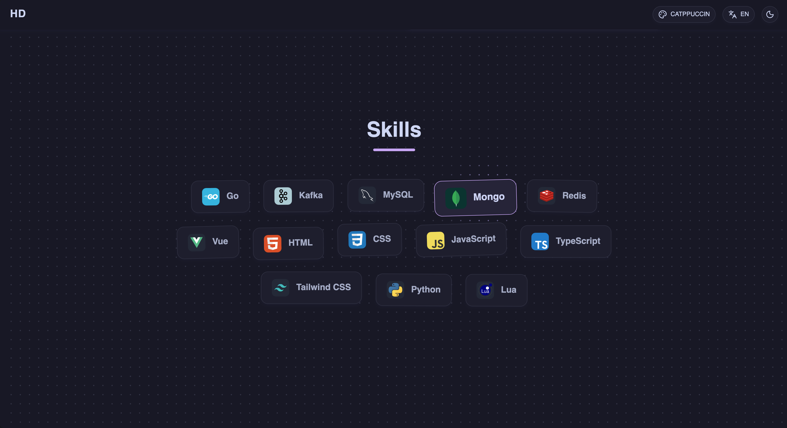
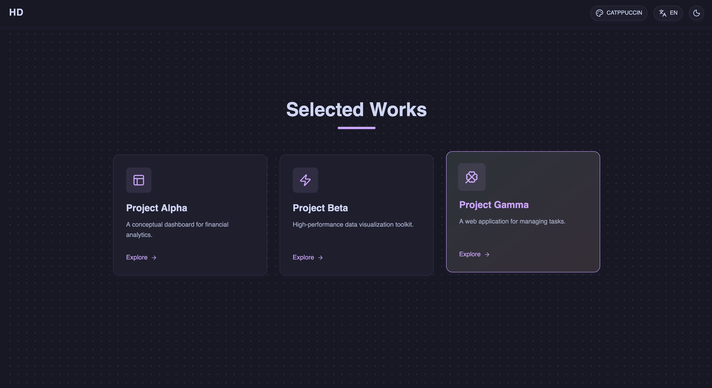
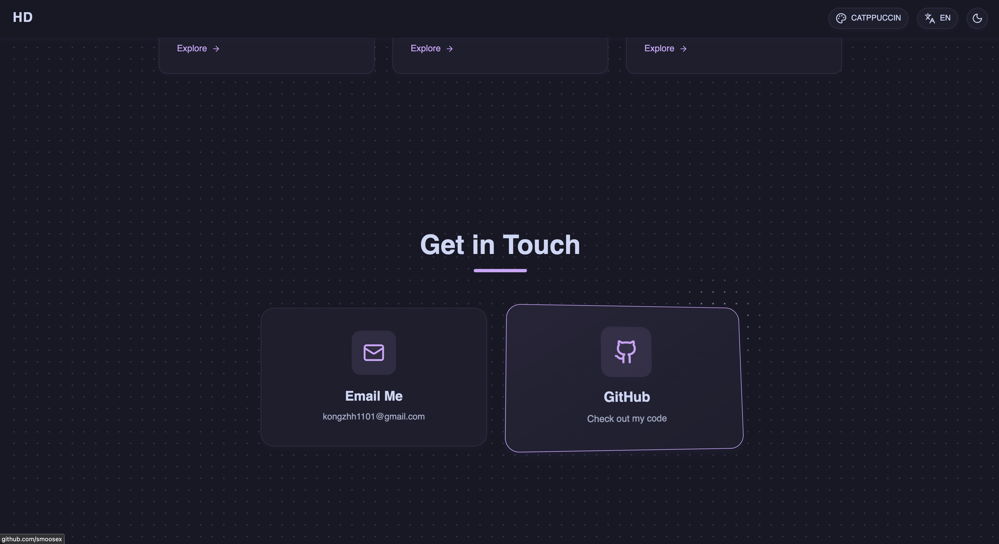

# Lumina

[English](README.md) | [中文](README.zh-CN.md)

A modern, highly customizable portfolio template built with **Vue 3**, **TypeScript**, **Tailwind CSS**, and **GSAP**.

<p align="center">
  
  
  
  
  
  
  
  
</p>

## Features

- 🎨 **Modern Design**: Clean, dark-mode first design with solid style.
- 🚀 **High Performance**: Built on Vite and Bun for lightning-fast development and build speeds.
- 🎭 **Rich Animations**: Powered by GSAP (ScrollTrigger, ScrollToPlugin) for smooth interactions.
- 🌌 **3D Elements**: Integrated Three.js particle model for an impressive hero section.
- 🧩 **Configurable**: All personal data (profile, skills, projects) is extracted to a single config file.
- 📱 **Responsive**: Fully responsive layout that looks great on all devices.
- 🌐 **i18n Ready**: Built-in internationalization support.

## Tech Stack

- **Framework**: [Vue 3](https://vuejs.org/) (Script Setup)
- **Build Tool**: [Vite](https://vitejs.dev/)
- **Runtime**: [Bun](https://bun.sh/) (Compatible with Node.js)
- **Styling**: [Tailwind CSS](https://tailwindcss.com/)
- **Animations**: [GSAP](https://greensock.com/gsap/)
- **3D**: [Three.js](https://threejs.org/)
- **State Management**: [Pinia](https://pinia.vuejs.org/)
- **Icons**: [Unplugin Icons](https://github.com/antfu/unplugin-icons) (Lucide, Skill Icons)

## Getting Started

### Prerequisites

- [Bun](https://bun.sh/) (Recommended) or Node.js (v20+)

### Installation

1. Clone the repository:

   ```bash
   git clone https://github.com/yourusername/portfolio.git
   cd portfolio
   ```

2. Install dependencies:

   ```bash
   bun install
   # or
   npm install
   ```

3. Start the development server:
   ```bash
   bun dev
   # or
   npm run dev
   ```

## Customization

All personal information and configuration is located in `src/config/site.ts`.

### 1. Update Profile & Links

Edit `src/config/site.ts` to update your name, role, email, and social links.

```typescript
export const siteConfig = {
  profile: {
    name: "Your Name",
    role: "Your Role",
    // ...
  },
  // ...
};
```

### 2. Update Skills

Modify the `skills` array in `src/config/site.ts`. You can use any icon from [Iconify](https://icones.js.org/).
Note: This project uses `unplugin-icons` with auto-import. If you add a new icon set, make sure to install it (e.g., `bun add -D @iconify-json/mdi`).

### 3. Update Projects

Modify the `works` array in `src/config/site.ts` to showcase your projects.
