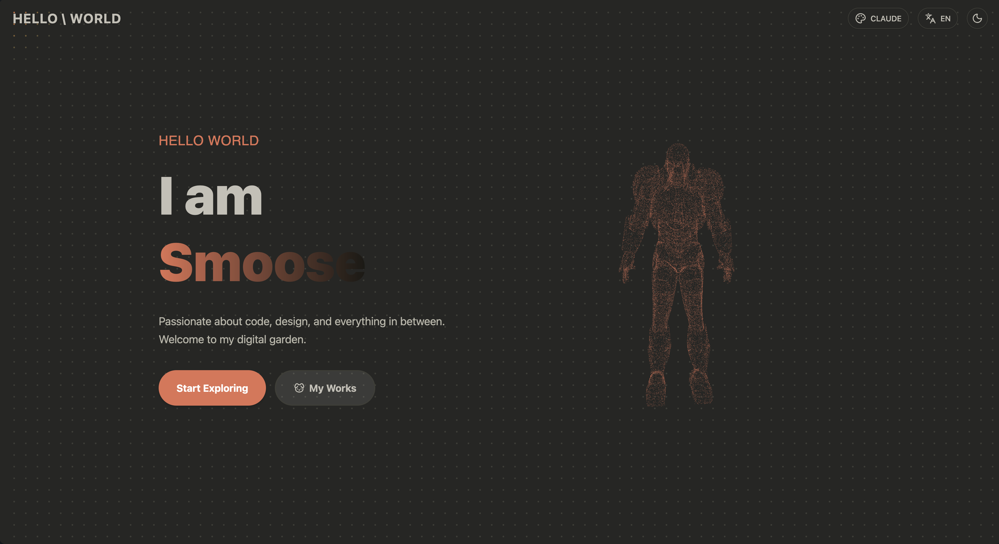
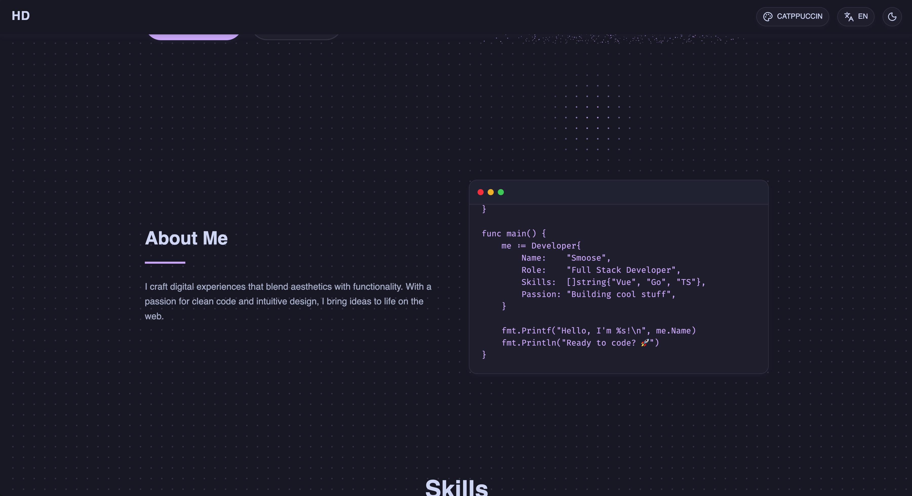
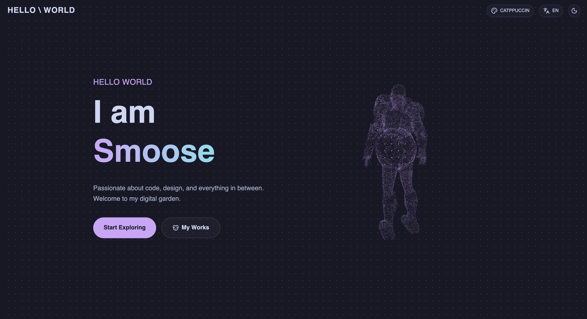
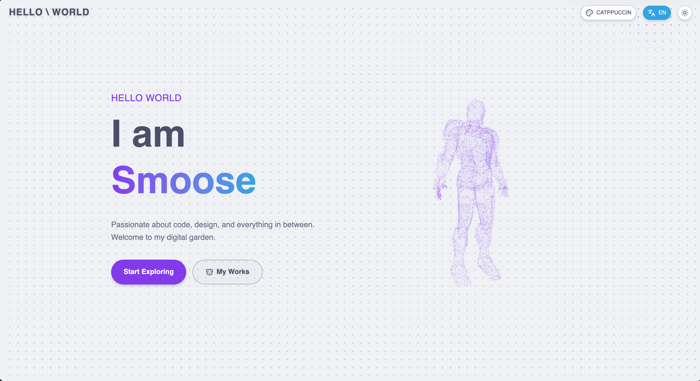
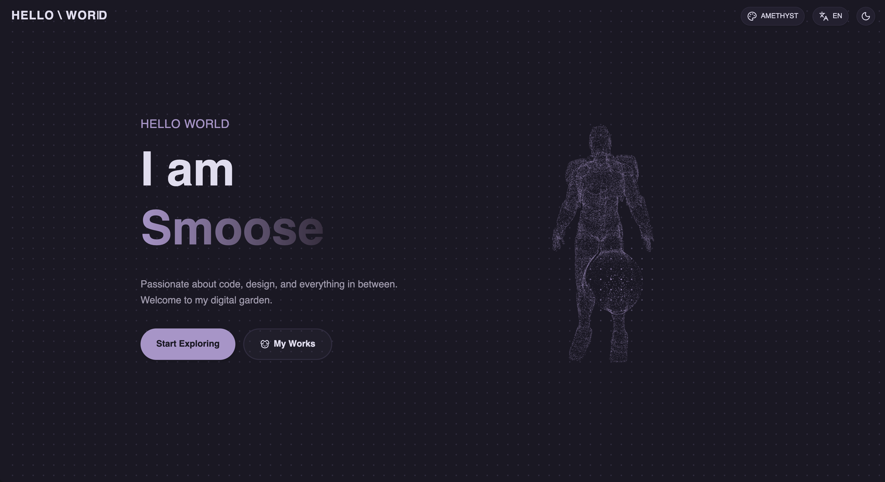
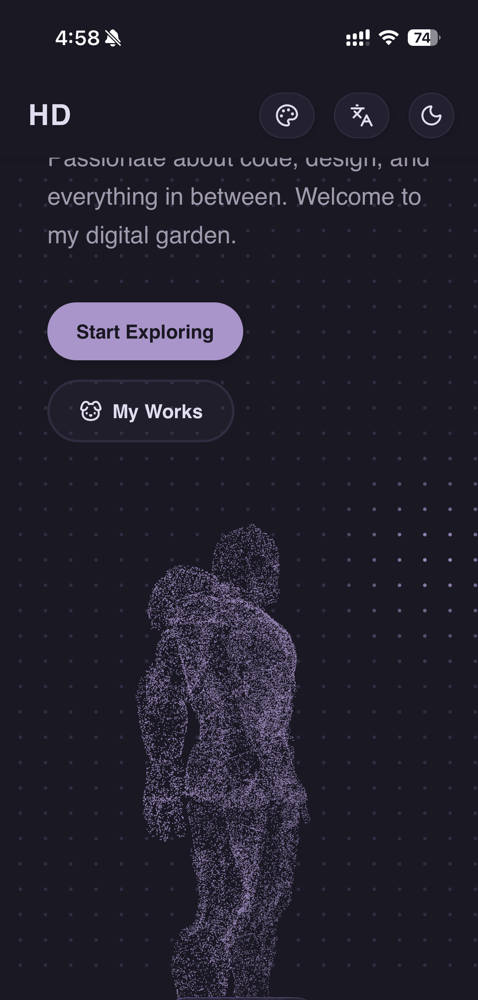

# Lumina

[English](README.md) | [中文](README.zh-CN.md)

一个基于 **Vue 3**, **TypeScript**, **Tailwind CSS**, 和 **GSAP** 构建的现代、高度可定制的个人主页模板。

<p align="center">
  
  
  
  
  
  
</p>

## 特性

- 🎨 **现代设计**: 简洁、暗黑模式优先的 Solid 风格。
- 🚀 **高性能**: 基于 Vite 和 Bun 构建，开发和构建速度极快。
- 🎭 **丰富动画**: 由 GSAP (ScrollTrigger, ScrollToPlugin) 驱动的流畅交互体验。
- 🌌 **3D 元素**: 集成 Three.js 粒子模型，打造令人印象深刻的 Hero 区域。
- 🧩 **易于配置**: 所有个人数据（个人资料、技能、项目）都抽离到了一个配置文件中。
- 📱 **响应式**: 完美适配各种设备屏幕。
- 🌐 **i18n 支持**: 内置国际化支持。

## 技术栈

- **框架**: [Vue 3](https://vuejs.org/) (Script Setup)
- **构建工具**: [Vite](https://vitejs.dev/)
- **运行时**: [Bun](https://bun.sh/) (兼容 Node.js)
- **样式**: [Tailwind CSS](https://tailwindcss.com/)
- **动画**: [GSAP](https://greensock.com/gsap/)
- **3D**: [Three.js](https://threejs.org/)
- **状态管理**: [Pinia](https://pinia.vuejs.org/)
- **图标**: [Unplugin Icons](https://github.com/antfu/unplugin-icons) (Lucide, Skill Icons)

## 快速开始

### 前置要求

- [Bun](https://bun.sh/) (推荐) 或 Node.js (v20+)

### 安装

1. 克隆仓库:

   ```bash
   git clone https://github.com/yourusername/lumina.git
   cd lumina
   ```

2. 安装依赖:

   ```bash
   bun install
   # 或
   npm install
   ```

3. 启动开发服务器:
   ```bash
   bun dev
   # 或
   npm run dev
   ```

## 自定义配置

所有个人信息和配置都位于 `src/config/site.ts`。

### 1. 更新个人资料和链接

编辑 `src/config/site.ts` 更新你的名字、角色、邮箱和社交链接。

```typescript
export const siteConfig = {
  profile: {
    name: "Your Name",
    role: "Your Role",
    // ...
  },
  // ...
};
```

### 2. 更新技能

修改 `src/config/site.ts` 中的 `skills` 数组。你可以使用 [Iconify](https://icones.js.org/) 上的任何图标。
注意: 本项目使用 `unplugin-icons` 自动导入。如果你添加了新的图标集，请确保安装它 (例如: `bun add -D @iconify-json/mdi`)。

### 3. 更新项目

修改 `src/config/site.ts` 中的 `works` 数组来展示你的项目。

### 4. 自定义 About 代码展示

你可以修改 `src/config/site.ts` 中的 `aboutCode` 函数，自定义 About 区域展示的代码内容（支持动态插入个人信息）。
